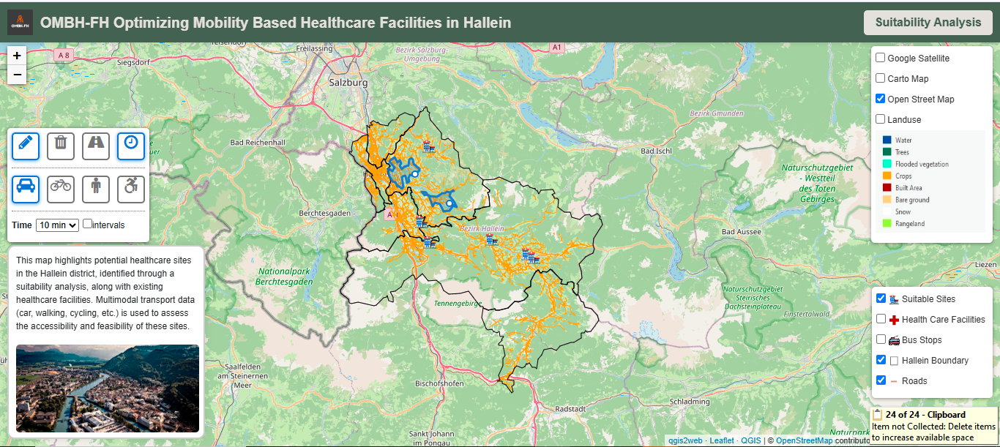

# 🏥 OMBH-FH
## Optimizing Mobility-Based Healthcare Facilities in Hallein

> A GIS-based suitability and accessibility analysis for identifying potential healthcare facility locations in Hallein, Austria.

OMBH-FH explores how **spatial analysis, multi-criteria suitability modelling, mobility data, and Web GIS** can support healthcare facility planning and accessibility assessment.

The project combines environmental, demographic, infrastructure, and accessibility factors to identify suitable locations for healthcare facilities and communicates the results through an **interactive Web GIS application** and an **ArcGIS StoryMap**.

  

  <em>Interactive Web GIS for exploring suitable healthcare locations and multimodal accessibility in Hallein, Austria.</em>

---

## 🌐 Explore the Project

### 🗺️ Interactive Web GIS
[Open the Interactive Web Map](https://nomaansaleh.github.io/OMBH-FH-Optimizing-Mobility-Based-Healthcare-Facilities-in-Hallein/)

### 📖 ArcGIS StoryMap
[Explore the Project StoryMap](https://arcg.is/0O45OP1)

---

## 📌 Project Overview

Access to healthcare infrastructure is strongly influenced by the spatial distribution of population, transportation networks, existing services, and environmental conditions.

This project investigates potential locations for healthcare facilities in the **Hallein district, Salzburg, Austria** using GIS-based suitability analysis.

The analysis consists of two main components:

1. **Suitability Analysis**  
   Identification of potential healthcare facility locations using a weighted-overlay model combining multiple spatial criteria.

2. **Accessibility and Mobility Assessment**  
   Evaluation of selected locations in relation to transportation and accessibility factors, supported by an interactive Web GIS environment.

---

## 🎯 Objectives

The project aims to:

- Identify and evaluate potential locations for healthcare facilities in Hallein.
- Integrate demographic, environmental, infrastructure, and accessibility factors within a GIS-based decision-support workflow.
- Apply a **weighted-overlay suitability analysis** to identify priority areas.
- Examine proximity to roads and public transport infrastructure.
- Evaluate mobility-based accessibility of potential healthcare locations.
- Develop an interactive Web GIS application for exploring the results.
- Communicate the analytical workflow and findings through an ArcGIS StoryMap.

---

## 📍 Study Area

The study focuses on the **Hallein district in the federal state of Salzburg, Austria**.

Hallein combines urban settlements, transport corridors, valleys, and mountainous terrain. These geographical characteristics make healthcare accessibility and facility-location planning an interesting spatial decision-making problem.

---

## 🗂️ Spatial Criteria

Seven spatial criteria were incorporated into the suitability analysis:

| Criterion | Weight |
|---|---:|
| Population | 25% |
| Existing Healthcare Facilities | 20% |
| Road Network | 15% |
| Land Cover | 15% |
| Bus Stops | 10% |
| Pharmacies | 10% |
| Slope | 5% |
| **Total** | **100%** |

### 👥 Population

Population distribution was used to represent potential healthcare demand. Population data were reclassified to generate standardized suitability values for the weighted-overlay analysis.

### 🏥 Existing Healthcare Facilities

Existing healthcare facilities were included to identify areas that may be underserved and to reduce unnecessary concentration of new facilities around existing services.

### 🛣️ Road Network

Proximity to the road network was considered an important accessibility factor. Distance analysis was used to identify locations with suitable road access.

### 🚏 Bus Stops

Bus-stop proximity was incorporated to account for access to public transportation and improve the accessibility of potential healthcare locations.

### 🌍 Land Cover

Land-cover information was used to distinguish potentially suitable areas from unsuitable land-cover classes.

### ⛰️ Slope

Terrain slope was derived from elevation data and reclassified to account for topographic suitability.

### 💊 Pharmacies

Proximity to pharmacies was considered because of their relationship with healthcare services and existing healthcare infrastructure.

---

## ⚙️ Methodology

The analytical workflow followed a multi-stage GIS approach:

### 1. Data Collection and Preparation

Spatial datasets were collected from multiple sources, including **ArcGIS Living Atlas** and **Open Data Austria**.

The datasets were prepared, transformed, and processed to create comparable analytical layers for the Hallein study area.

### 2. Spatial Processing

Individual spatial criteria were processed using GIS operations including:

- clipping to the study area
- raster preparation
- reclassification
- proximity/distance analysis
- terrain/slope analysis
- spatial standardization

### 3. Criteria Reclassification

Each criterion was converted into a standardized suitability scale so that datasets representing different spatial characteristics could be combined.

### 4. Weighted Overlay

The standardized criteria were integrated using a **weighted-overlay analysis**.

Each criterion was assigned a percentage weight according to its relevance to healthcare facility suitability, with all weights summing to 100%.

### 5. Suitability Classification

The resulting suitability surface was interpreted using suitability zones ranging from restricted/unsuitable areas to increasingly suitable locations.

### 6. Candidate Site Identification

The final suitability analysis identified **six potential healthcare facility locations**.

- Four candidate sites were located within highly suitable zones.
- Two candidate sites were located within moderately suitable combinations of suitability zones.

### 7. Accessibility and Web GIS

The selected locations were incorporated into an interactive Web GIS environment to support exploration of:

- suitable healthcare sites
- existing healthcare facilities
- bus stops
- road networks
- administrative boundaries
- land-use/land-cover information
- transportation and accessibility relationships

---

## 🗺️ Interactive Web GIS

A browser-based interactive map was developed to allow users to explore the spatial results beyond static cartographic outputs.

### Key Features

- Interactive layer control
- Multiple basemap options
- Suitable-site visualization
- Existing healthcare facility layer
- Bus-stop visualization
- Road-network visualization
- Hallein administrative boundary
- Land-use/land-cover information
- Distance-based spatial exploration
- Mobility/accessibility controls
- Interactive map navigation

➡️ **[Launch the Interactive Web Map](https://nomaansaleh.github.io/OMBH-FH-Optimizing-Mobility-Based-Healthcare-Facilities-in-Hallein/)**

---

## 📖 ArcGIS StoryMap

An ArcGIS StoryMap was developed to document and communicate the project from the initial planning problem through the individual spatial criteria, weighted-overlay analysis, and final suitable-site selection.

The StoryMap provides a visual explanation of the:

- project objectives
- study area
- datasets
- population analysis
- existing healthcare facilities
- road accessibility
- public transport accessibility
- land-cover analysis
- slope analysis
- pharmacy accessibility
- weighted-overlay methodology
- suitable-site results
- conclusions

➡️ **[Explore the ArcGIS StoryMap](https://arcg.is/0O45OP1)**

---

## 📊 Results

The weighted-overlay analysis produced a spatial suitability surface for potential healthcare facility development in Hallein.

Based on the final suitability results:

- **Six candidate sites** were identified.
- **Four sites** were located within highly suitable areas.
- **Two sites** were associated with moderately suitable combinations of suitability classes.

The results demonstrate how multiple spatial criteria can be integrated into a GIS-based decision-support framework for healthcare facility planning.

---

## 🛠️ Technologies & Tools

### GIS & Spatial Analysis
- ArcGIS Pro
- Spatial Analyst tools
- Weighted Overlay
- Euclidean Distance
- Raster Reclassification
- Slope Analysis

### Web GIS & Visualization
- Leaflet
- JavaScript
- HTML/CSS
- ArcGIS StoryMaps
- Interactive Web Mapping

### Spatial Data
- ArcGIS Living Atlas
- Open Data Austria
- Road and public transport data
- Population data
- Land-cover data
- Elevation/terrain data
- Healthcare and pharmacy data

---

## 👤 My Contribution

This project was developed as an academic geoinformatics project at the **University of Salzburg**.

My work included:

- project concept development
- spatial-data collection and preparation
- GIS-based suitability modelling
- criteria reclassification and weighting
- proximity and terrain analysis
- candidate-site identification
- mobility and accessibility assessment
- interactive Web GIS development
- cartographic visualization
- ArcGIS StoryMap development
- project documentation and communication

---

## 💡 Key Learning Outcomes

Through this project, I strengthened my practical experience in:

- multi-criteria spatial decision analysis
- healthcare accessibility analysis
- raster-based suitability modelling
- spatial data preparation and integration
- transportation and accessibility analysis
- interactive Web GIS development
- communicating GIS workflows to non-technical audiences

---

## ⚠️ Limitations & Future Development

Suitability modelling is sensitive to the quality of input datasets, the selected criteria, classification rules, and assigned weights.

Future development could include:

- sensitivity analysis of criterion weights
- additional demographic and socioeconomic variables
- travel-time-based network accessibility analysis
- validation of candidate sites using field or authoritative planning data
- comparison with alternative multi-criteria decision-analysis approaches
- improved responsive design and Web GIS functionality

---

## 🎓 Academic Context

**Project:** Optimizing Mobility-Based Healthcare Facilities in Hallein  
**Project abbreviation:** OMBH-FH  
**Institution:** University of Salzburg  
**Field:** Applied Geoinformatics  
**Study area:** Hallein, Salzburg, Austria  
**Project period:** September 2024 – January 2025

---

## 📚 References

The analytical design was informed by research on healthcare accessibility, GIS-based healthcare planning, spatial suitability analysis, and transportation accessibility.

A complete reference list and detailed methodological presentation are available in the project StoryMap.

➡️ **[View the full project documentation](https://arcg.is/0O45OP1)**

---

## 👨‍💻 Author

**Md Saleh Shakeel Nomaan**  
MSc Applied Geoinformatics  
University of Salzburg, Austria

[LinkedIn](https://www.linkedin.com/in/md-saleh-shakeel-nomaan)
